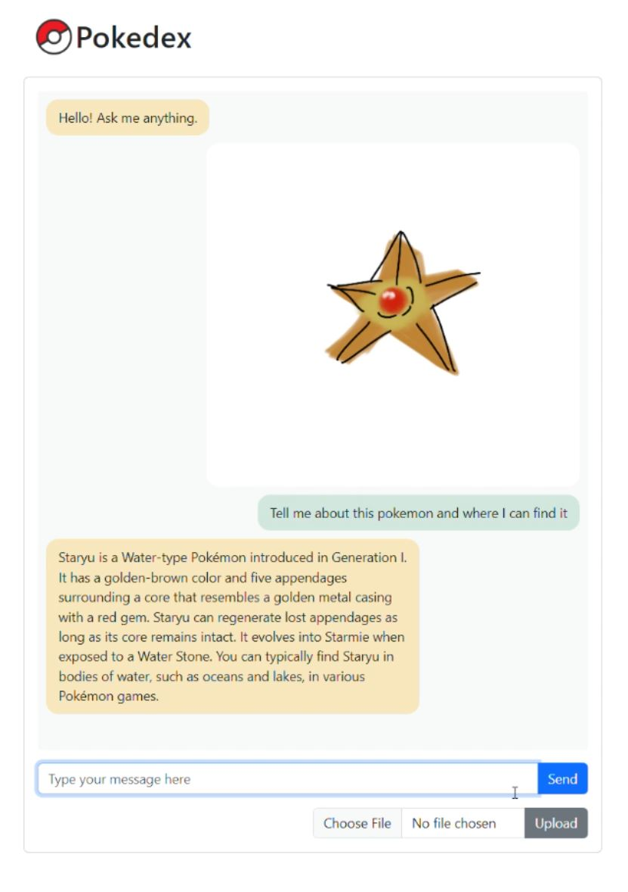

# Pokedex
RAG architecture implemented with LLM agent for Pokedex chatbot. Retrieve information about pokemons from wiki pages and identify pokemons from images. (Currently only contains the origin gen 151 pokemons)
---

## Features

### 🔎 Pokemon identification
The most basic feature of a pokedex is to scan and identify pokemons in the wild. Sadly, you don't see actual pokemons in the wild, so we just have to make do with images. You can upload an image of a pokemon to the pokedex and ask questions regarding it, the pokedex will identify the pokemon and search the wiki to answer your questions.
> 💡 This feature uses a retriever built from a pre-trained ViT model to extract image embeddings of pokemon in the database, and then conduct a similarity search against the uploaded image to identify the pokemon.
### 📖 Pokemon Q&A
You can ask questions about a pokemon and the pokedex will search the wiki pages to answer your questions. Questions can be about the pokemon's stats, height or the episodes in which it appeared in the Pokemon anime.
> 💡 This is achieved with classic RAG. Additionally, the LLM agents will often chain this task with other tasks depending on the questions asked. This allows users to ask questions about the pokemon based on an image.
### ❓ Get pokemon by type
You can also ask the pokedex to list pokemons of a certain type. This feature also allows you to get the pokedex to suggest a pokemon that is strong against a certain another pokemon.
> 💡 This is achieved by saving pokemon type information in the meta-data of the pokemon documents. The retriever will query from the meta-data which avoids going through the entire document.

## Demo
</img>

## Try it out
Using OpenAI as LLM so have your API key ready in env.

Run `uvicorn chat:app --reload` to start the server.

## TODO:
- [ ] Add img embedding cache
- [ ] Complete to-do list

